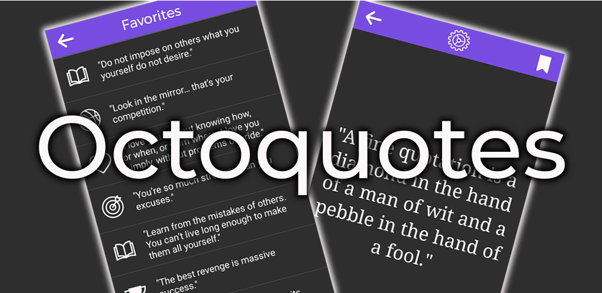

# OctoQuotes

 

OctoQuotes is a quotes app that contains more than 2000 citations broken down into 15 different categories such as Attitude, Humor, Love, Motivation, Sports and Coding. It has a rather minimalist design while still providing essential features like

- dark and light mode
- randomization
- favourites collection

and more. You'll get the hang of it pretty quickly.

Just don't use the in-app feedback and suggestion to the app developer functionality - I've discontinued using [Cloud Firestore](https://firebase.google.com/docs/firestore) which backed that feature a while ago (mostly for privacy protection reasons).

## Download & Installation

You can download the APK at the top-level of this repository [octoquotes.apk](https://github.com/lchristmann/android-octoquotes/blob/main/octoquotes.apk).

Install it by clicking on the downloaded file and following the instructions of your phone or go along some tutorial on the internet. It will warn you that APKs from an unknown source are dangerous - and they may be. So if you have doubts either (1) [contact](https://lchristmann.com/contact/) and [get to know me](https://lchristmann.com) or (2) download the whole source code provided here, review it and build the APK yourself with [Android Studio](https://developer.android.com/studio).

> If you're inspecting the source code and wondering about the name "DevOps4u" being used in some places: that's just the first name I've given the app before I chose "OctoQuotes". Some remains - invisble to the user of course - can still be found.

## Background story

You can read about how I got to develop this and two more Android applications on my personal website at [lchristmann.com/projects/app-development](https://lchristmann.com/projects/app-development/).